<div align="center">
  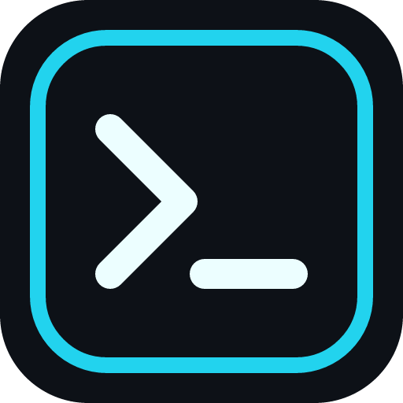

# Winmux

### The command center Windows terminals deserve.

Organize shells by project. Split them into panes. Know when the work is done.

[](https://github.com/byalex33/Winmux/actions/workflows/ci.yml)
[](LICENSE)
[](#requirements)
[](https://tauri.app/)
[](#project-status)

[Get started](#get-started) · [Features](#why-winmux) · [Shortcuts](#keyboard-first) · [Contribute](#contributing)

</div>

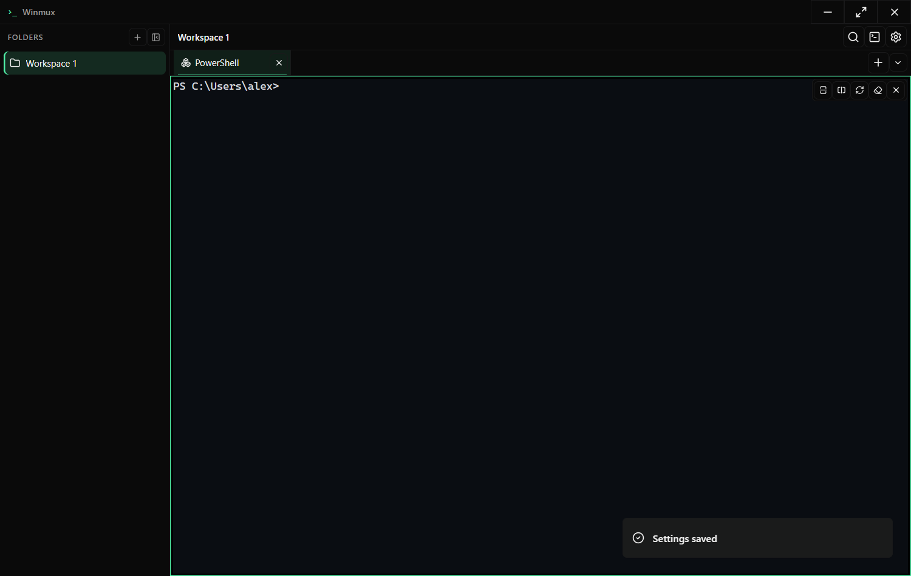

## One window. Every command line.

Winmux is a native Windows terminal workspace built for people who live in shells. It groups terminals into persistent project folders, gives every tab a resizable split layout, and surfaces meaningful activity without turning your desktop into notification confetti.

No server. No account. No cloud workspace. Your terminals and settings stay on your machine.

> [!IMPORTANT]
> Winmux is in public preview. The core workflow is usable today, but interfaces and saved settings may evolve before 1.0.

## Why Winmux?

| | Capability | What it changes |
| :--: | --- | --- |
| 📁 | **Project folders** | Keep each codebase, environment, or mission in its own terminal workspace. |
| ◫ | **Split layouts** | Run the app, tests, logs, and debugger side by side in one tab. |
| ⚡ | **Command palette** | Fuzzy-find actions without leaving the keyboard. |
| ◉ | **Activity signals** | See completed, failed, waiting, and bell states at a glance. |
| 🔔 | **Native notifications** | Get useful Windows notifications when an unfocused command needs you. |
| >_ | **Real shell profiles** | Use PowerShell, Command Prompt, WSL, Git Bash, or your own executable. |
| ◇ | **Seven built-in themes** | Start with a considered theme, then tune fonts, cursor, accent, and spacing. |
| ↺ | **Persistent workspaces** | Restore folders, tabs, pane trees, ratios, profiles, and settings. |

<table>
  <tr>
    <td width="50%">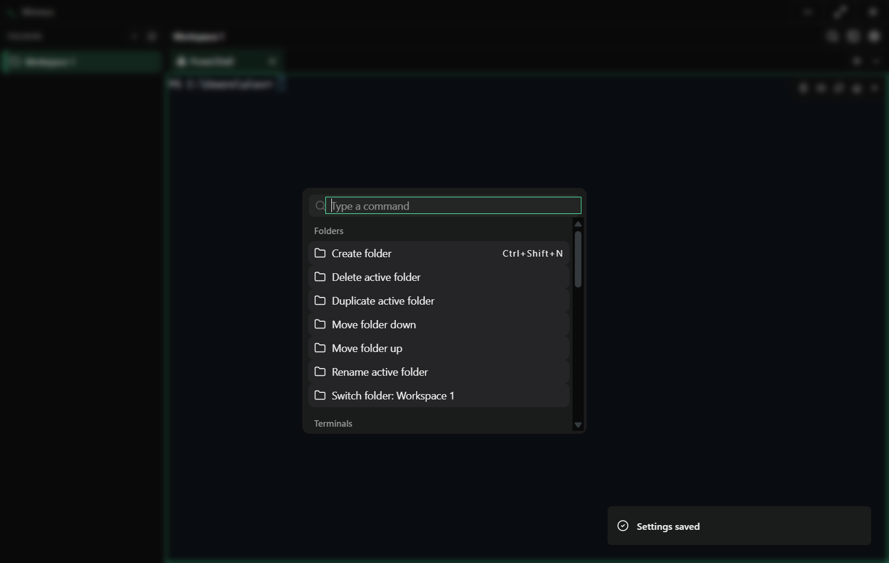</td>
    <td width="50%">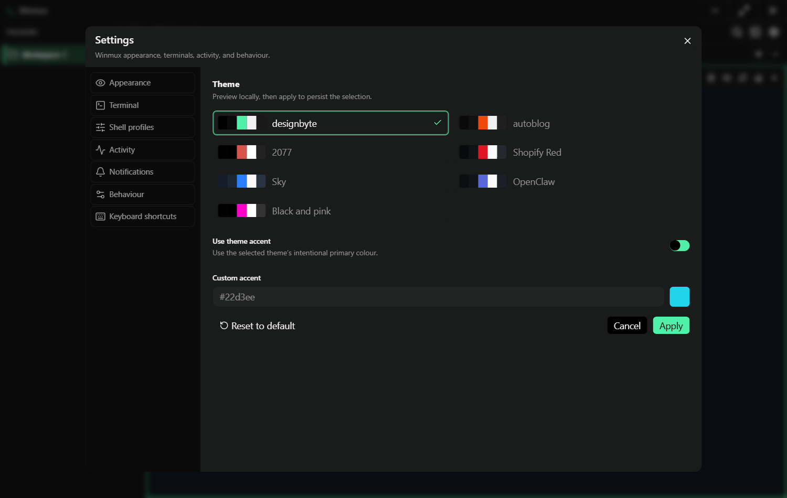</td>
  </tr>
  <tr>
    <td align="center"><strong>Everything is a command</strong></td>
    <td align="center"><strong>Make the cockpit yours</strong></td>
  </tr>
</table>

## Get started

### Requirements

- Windows 10 or 11
- [Node.js 22+](https://nodejs.org/)
- [Rust stable](https://www.rust-lang.org/tools/install) with the MSVC toolchain
- Microsoft Edge WebView2 (already included on current Windows installs)

### Run from source

```powershell
git clone https://github.com/byalex33/Winmux.git
cd Winmux
npm install
npm run tauri dev
```

### Build an installer

```powershell
npm run tauri build
```

Tauri writes the Windows installers to `src-tauri/target/release/bundle/`.

## Keyboard first

| Action | Shortcut |
| --- | :---: |
| Command palette | <kbd>Ctrl</kbd> + <kbd>Shift</kbd> + <kbd>P</kbd> |
| New terminal | <kbd>Ctrl</kbd> + <kbd>Shift</kbd> + <kbd>T</kbd> |
| Create folder | <kbd>Ctrl</kbd> + <kbd>Shift</kbd> + <kbd>N</kbd> |
| Split right / down | <kbd>Ctrl</kbd> + <kbd>Shift</kbd> + <kbd>D</kbd> / <kbd>E</kbd> |
| Close pane | <kbd>Ctrl</kbd> + <kbd>Shift</kbd> + <kbd>W</kbd> |
| Search terminal | <kbd>Ctrl</kbd> + <kbd>F</kbd> |
| Next tab | <kbd>Ctrl</kbd> + <kbd>Tab</kbd> |
| Switch folder | <kbd>Ctrl</kbd> + <kbd>1</kbd>…<kbd>9</kbd> |
| Previous / next folder | <kbd>Ctrl</kbd> + <kbd>PageUp</kbd> / <kbd>PageDown</kbd> |
| Move between panes | <kbd>Alt</kbd> + <kbd>Arrow</kbd> |

## Seven moods. One workflow.

Every theme controls the full interface and terminal palette—not just an accent colour.

<table>
  <tr>
    <td width="33%">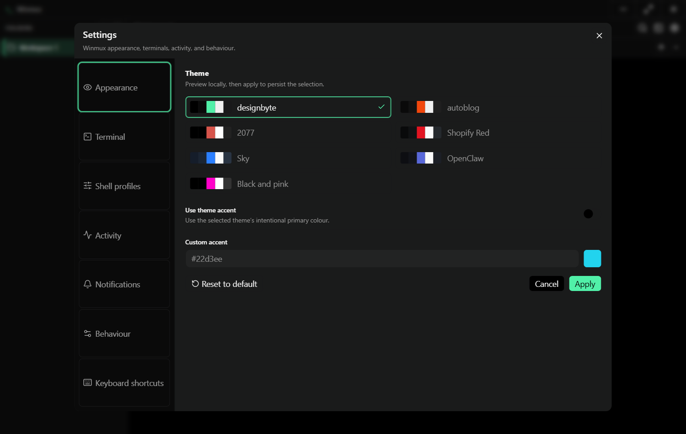</td>
    <td width="33%">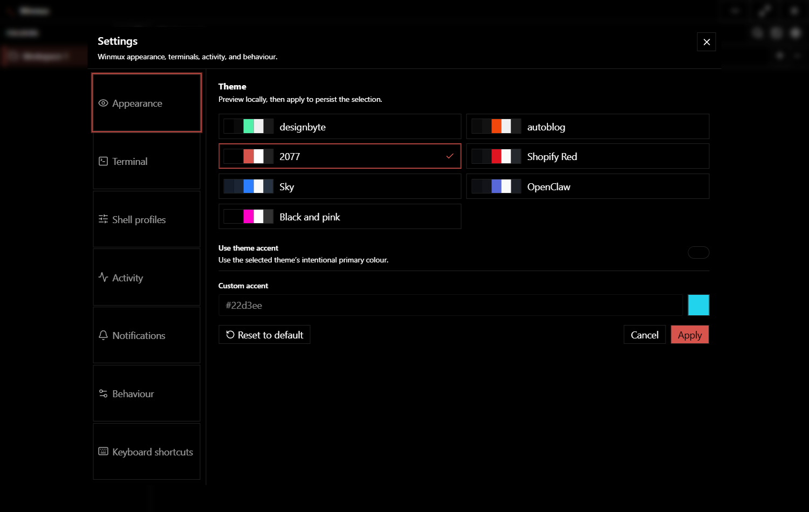</td>
    <td width="33%">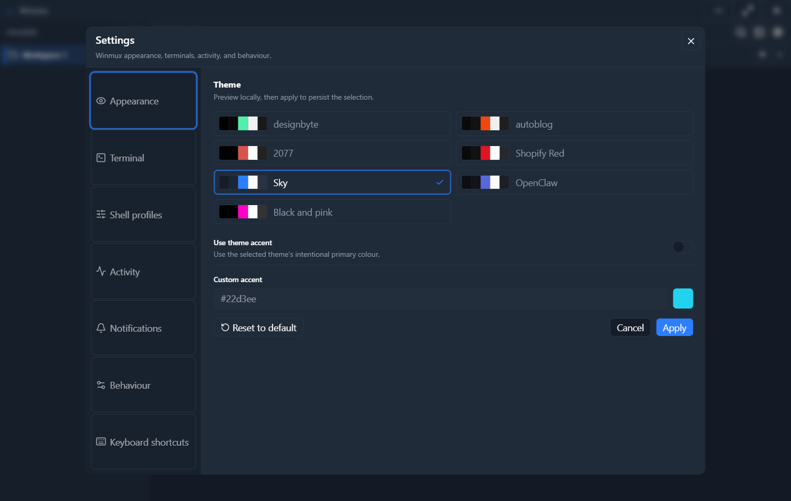</td>
  </tr>
  <tr>
    <td align="center"><strong>designbyte</strong></td>
    <td align="center"><strong>2077</strong></td>
    <td align="center"><strong>Sky</strong></td>
  </tr>
  <tr>
    <td width="33%">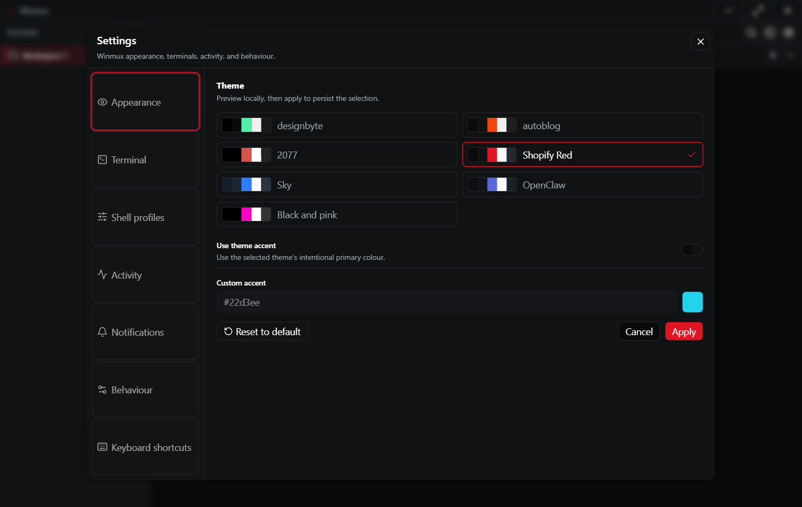</td>
    <td width="33%">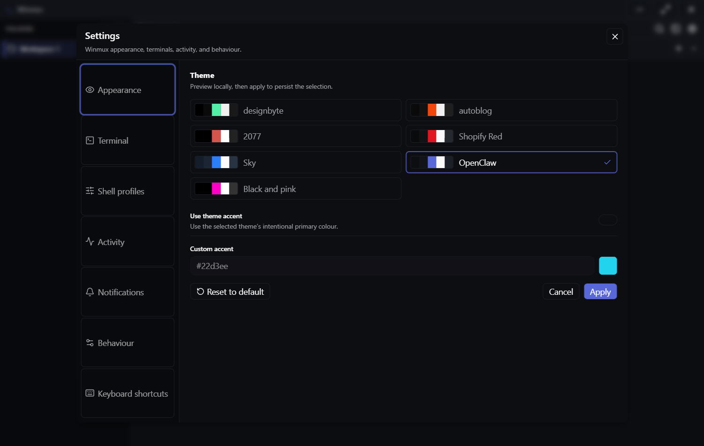</td>
    <td width="33%">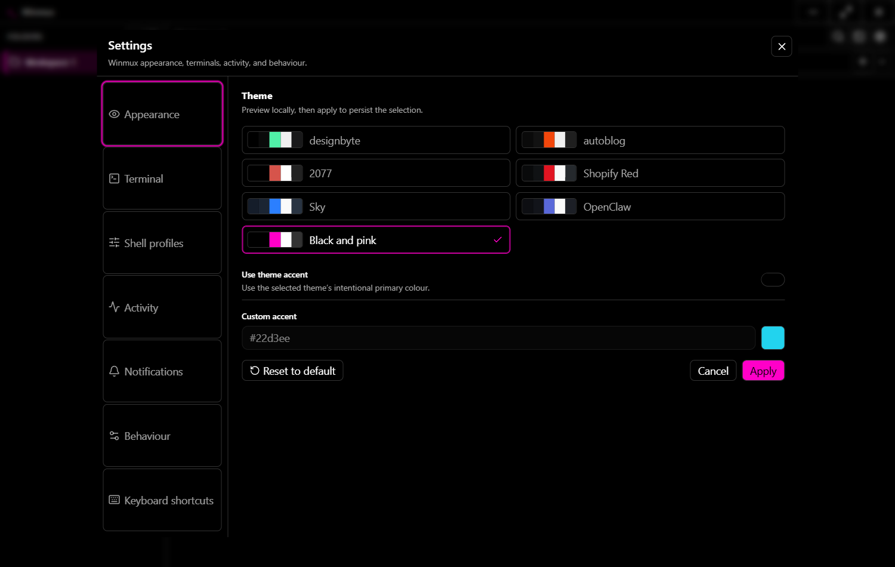</td>
  </tr>
  <tr>
    <td align="center"><strong>Shopify Red</strong></td>
    <td align="center"><strong>OpenClaw</strong></td>
    <td align="center"><strong>Black and pink</strong></td>
  </tr>
</table>

## Under the hood

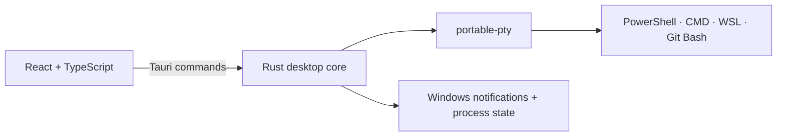

- **Frontend:** React 19, TypeScript, Vite, xterm.js, Radix UI
- **Desktop shell:** Tauri 2
- **Terminal engine:** Rust and `portable-pty`
- **Quality:** ESLint, Prettier, Vitest, Testing Library, GitHub Actions

The frontend owns workspace state, layouts, themes, commands, and terminal rendering. The small Rust core owns PTY processes, shell detection, foreground-process checks, and native Windows integration.

## Project status

Winmux is an early public preview focused on getting the terminal-workspace loop right.

- [x] Folders, terminal tabs, and nested split panes
- [x] Shell discovery and custom profiles
- [x] Persistent layouts and settings
- [x] Search, context menus, and command palette
- [x] Activity tracking and native notifications
- [x] Theme and terminal customization
- [ ] Signed installers through GitHub Releases
- [ ] Configurable keyboard shortcuts
- [ ] Workspace import and export

Have a stronger next step? [Open an issue](https://github.com/byalex33/Winmux/issues) and make the case.

## Development

```powershell
npm install          # dependencies
npm run tauri dev    # desktop app with hot reload
npm test             # test suite
npm run lint         # lint the codebase
npm run typecheck    # TypeScript checks
npm run build        # production frontend
```

## Contributing

Issues, focused pull requests, theme ideas, and Windows edge cases are welcome.

1. Fork the repository and branch from `main`.
2. Keep each change focused and include the smallest useful test.
3. Run `npm run lint`, `npm test`, and `npm run build`.
4. Open a pull request explaining the user-visible change.

For vulnerabilities, use GitHub's **private security advisory** flow instead of a public issue.

## License

Winmux is released under the [MIT License](LICENSE).

---

<div align="center">
  <strong>Built for Windows. Designed for flow.</strong>
  <br /><br />
  If Winmux makes your terminal life calmer, consider giving the project a ⭐
</div>
